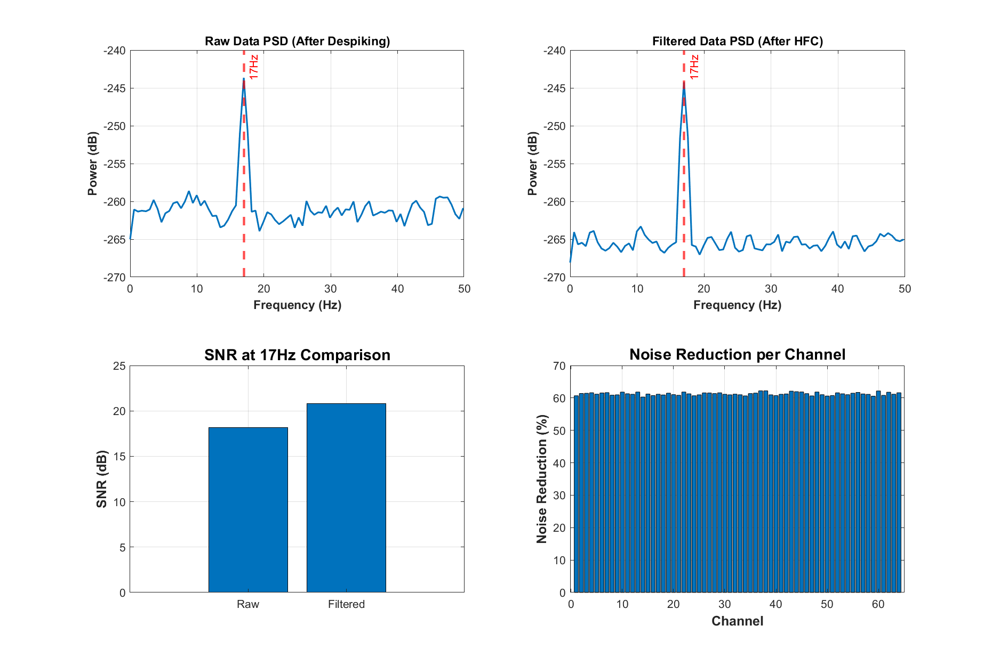
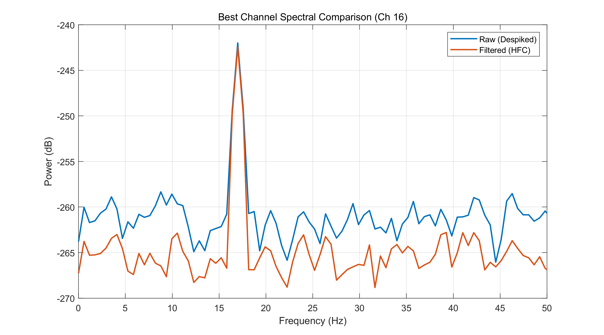
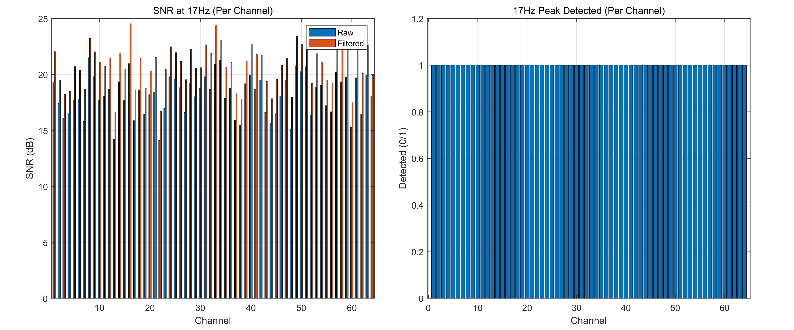
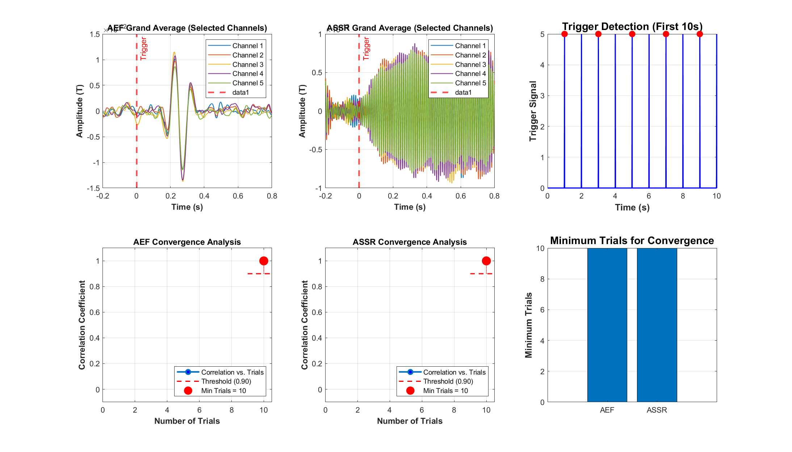
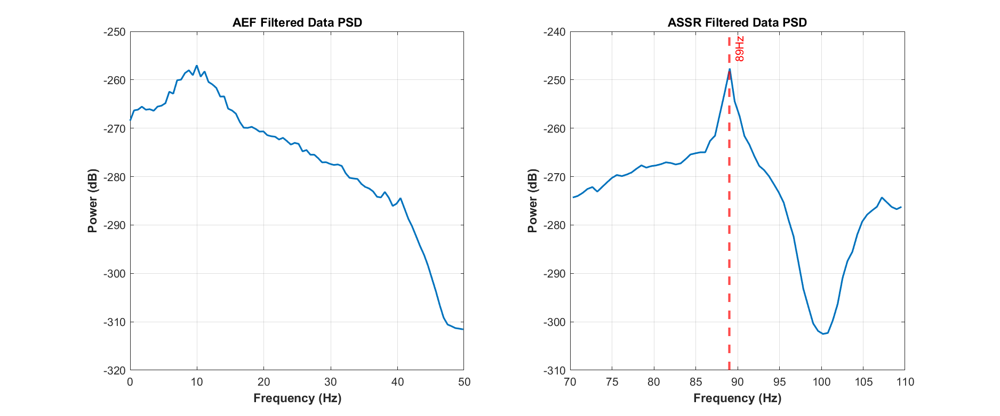
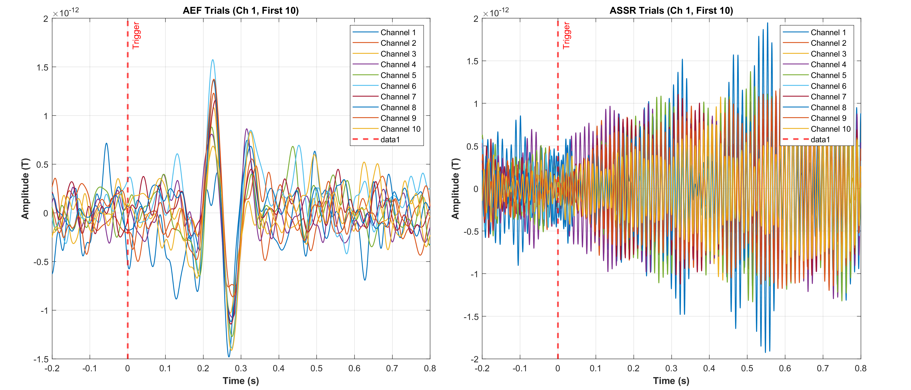

# Neuromag Toolkit

<p align="center">
  
  
  
</p>

<p align="center">
  <b>基于MATLAB的OPM-MEG信号处理工具包</b><br>
  用于处理光泵磁力计脑磁图（Optically Pumped Magnetometer - Magnetoencephalography）信号<br>
  具有先进的降噪、滤波和信号分析能力
</p>

---

## 目录

- [项目概述](#项目概述)
- [主要特性](#主要特性)
- [快速开始](#快速开始)
- [分析结果展示](#分析结果展示)
- [项目结构](#项目结构)
- [处理流程](#处理流程)
- [配置说明](#配置说明)
- [API参考](#api参考)
- [许可证](#许可证)

---

## 项目概述

本工具包提供完整的OPM-MEG信号处理流程，从原始LVM格式数据到最终分析结果的一站式解决方案。

### 支持的分析任务

| 任务 | 描述 | 关键技术 |
|------|------|----------|
| **Mission 1** | 从模体校准数据中提取17Hz正弦信号 | 自适应滤波、HFC降噪、PSD分析 |
| **Mission 2** | 从人类听觉数据中提取AEF和ASSR | 时程提取、试次平均、收敛分析 |

### 最新测试结果

| 任务 | 指标 | 结果 |
|------|------|------|
| Mission 1 | 噪声降低 | **61.27%** |
| Mission 1 | SNR提升 | **2.63 dB** |
| Mission 1 | 17Hz检测率 | **100%** (64/64通道) |
| Mission 2 | 噪声降低 | **68.95%** |
| Mission 2 | AEF最小收敛试次 | **10** |
| Mission 2 | ASSR最小收敛试次 | **10** |

---

## 主要特性

- **模块化架构** - 清晰的功能模块划分，易于扩展和维护
- **双轴数据处理** - 支持完整的Y+Z双轴OPM数据预处理
- **多种降噪算法** - LMS/RLS自适应滤波、均匀场校正(HFC)
- **频域分析** - 功率谱密度、信噪比计算、峰值检测
- **时域分析** - 触发检测、时程提取、总平均计算
- **收敛分析** - 确定最小所需试次数
- **全面可视化** - 丰富的图表输出和结果展示
- **FieldTrip集成** - 可选的高级功能支持

---

## 快速开始

### 环境要求

**必需：**
- MATLAB R2019b 或更高版本
- Signal Processing Toolbox

**可选：**
- Statistics and Machine Learning Toolbox
- FieldTrip Toolbox（需单独下载，见下方说明）

### 安装

```bash
git clone https://github.com/yibotesla/neuromag-toolkit.git
cd neuromag-toolkit
```

### FieldTrip 安装（可选）

FieldTrip工具箱用于高级数据可视化（topoplot）、源定位和时频分析等功能。由于体积较大（约500MB），未包含在本仓库中，请按需单独下载：

1. 从官网下载：https://www.fieldtriptoolbox.org/download/
2. 解压到项目根目录的 `fieldtrip/` 文件夹
3. 或修改 `default_config.m` 中的 `config.paths.fieldtrip_path` 指向你的FieldTrip安装路径

```matlab
% 在 default_config.m 中配置 FieldTrip 路径
config.paths.fieldtrip_path = 'C:/path/to/your/fieldtrip';
```

> **注意**：本工具包的核心功能不依赖FieldTrip，没有安装也可正常运行。

### 运行示例

```matlab
% 1. 设置路径
setup_paths

% 2. 运行 Mission1 演示（17Hz信号提取）
demo_mission1

% 3. 运行 Mission2 演示（听觉诱发响应）
demo_mission2
```

### 处理自定义数据

```matlab
% 加载配置
config = default_config();

% 修改数据路径
file_path = 'C:/your/data/path/data_1.lvm';

% 运行处理
results = process_mission1(file_path, config, 'SaveResults', true);
```

---

## 分析结果展示

### Mission 1: 17Hz信号提取

#### 频谱分析与SNR对比

<p align="center">
  
</p>

*左上：原始数据PSD；右上：滤波后PSD（HFC处理后）；左下：17Hz处SNR对比；右下：各通道噪声降低效果*

#### 处理前后频谱对比

<p align="center">
  
</p>

*最佳通道（Ch 16）的频谱对比，显示处理后整体噪声水平显著降低，17Hz信号峰值清晰可见*

#### 多通道分析

<p align="center">
  
</p>

*左：各通道在17Hz处的SNR（处理前后对比）；右：17Hz峰值检测结果（100%检测率）*

### Mission 2: 听觉诱发响应

#### 总平均与收敛分析

<p align="center">
  
</p>

*上排：AEF总平均、ASSR总平均、触发检测示意；下排：AEF/ASSR收敛曲线和最小试次数*

#### AEF与ASSR频谱特征

<p align="center">
  
</p>

*左：AEF滤波后数据PSD（低频成分）；右：ASSR滤波后数据PSD（89Hz稳态响应）*

#### 单试次波形示例

<p align="center">
  
</p>

*左：AEF单试次波形（前10个试次）；右：ASSR单试次波形（显示89Hz稳态振荡）*

---

## 项目结构

```
neuromag-toolkit/
├── data_loader/        # LVM文件解析和数据加载
├── preprocessor/       # 数据预处理（DC去除、坏通道检测、OPM专用处理）
├── denoiser/           # 噪声去除（尖峰去除、自适应滤波）
├── filter/             # 频域滤波（低通、带通、陷波、自适应）
├── analyzer/           # 信号分析（PSD、SNR、时程提取、收敛分析）
├── visualizer/         # 数据可视化和绘图
├── utils/              # 工具函数和数据结构类
├── scripts/            # 演示脚本和验证工具
├── tests/              # 单元测试、属性测试、集成测试
├── docs/               # 详细文档
├── outputs/            # 分析输出结果
├── fieldtrip/          # FieldTrip工具箱（可选依赖）
├── process_mission1.m  # Mission1 主处理脚本
├── process_mission2.m  # Mission2 主处理脚本
├── default_config.m    # 默认配置
├── setup_paths.m       # 路径设置
└── README.md           # 本文件
```

---

## 处理流程

### Mission 1: 模体数据处理流程

```
┌─────────────────┐
│   加载LVM数据    │
└────────┬────────┘
         ▼
┌─────────────────┐
│   通道识别分离   │  → MEG(1-64) / REF(65-67) / Trigger
└────────┬────────┘
         ▼
┌─────────────────┐
│    预处理       │  → DC去除 / 坏通道检测
└────────┬────────┘
         ▼
┌─────────────────┐
│   去除尖峰噪声   │  → 中值滤波 / 小波去噪
└────────┬────────┘
         ▼
┌─────────────────┐
│   自适应滤波     │  → RLS/LMS + 参考传感器
└────────┬────────┘
         ▼
┌─────────────────┐
│   PSD & SNR分析 │  → 17Hz峰值检测
└────────┬────────┘
         ▼
┌─────────────────┐
│  结果可视化输出  │
└─────────────────┘
```

### Mission 2: 听觉数据处理流程

```
┌─────────────────┐
│   加载LVM数据    │
└────────┬────────┘
         ▼
┌─────────────────┐
│   预处理 & 滤波  │
└────────┬────────┘
         ▼
    ┌────┴────┐
    ▼         ▼
┌───────┐ ┌───────┐
│AEF分支│ │ASSR分支│
│ LP 30 │ │BP 87-91│
└───┬───┘ └───┬───┘
    ▼         ▼
┌─────────────────┐
│   触发检测       │
└────────┬────────┘
         ▼
┌─────────────────┐
│   时程提取       │  → -200ms ~ +800ms
└────────┬────────┘
         ▼
┌─────────────────┐
│   总平均计算     │
└────────┬────────┘
         ▼
┌─────────────────┐
│   收敛分析       │  → 最小试次数确定
└────────┬────────┘
         ▼
┌─────────────────┐
│  结果可视化输出  │
└─────────────────┘
```

---

## 配置说明

### 主要配置参数

```matlab
config = default_config();

% 预处理参数
config.preprocessing.remove_dc = true;
config.preprocessing.bad_channel_threshold = 3.0;

% 自适应滤波参数
config.adaptive_filter.algorithm = 'RLS';  % 'LMS' 或 'RLS'
config.adaptive_filter.filter_order = 10;
config.adaptive_filter.lambda = 0.995;     % RLS遗忘因子

% 频率滤波参数
config.filters.aef_cutoff = 30;            % AEF低通截止(Hz)
config.filters.assr_center = 89;           % ASSR中心频率(Hz)
config.filters.assr_bandwidth = 2;         % ASSR带宽(Hz)

% 时程提取参数
config.epoching.pre_time = 0.2;            % 触发前时间(s)
config.epoching.post_time = 0.8;           % 触发后时间(s)

% 收敛分析参数
config.convergence.threshold = 0.9;        % 相关系数阈值
```

---

## API参考

### 主处理函数

```matlab
% Mission1: 17Hz信号提取
results = process_mission1(file_path, config, ...
    'PlotResults', true, ...
    'SaveResults', true, ...
    'OutputDir', 'outputs/mission1');

% Mission2: 听觉响应提取
results = process_mission2(file_path, config, ...
    'PlotResults', true, ...
    'SaveResults', true, ...
    'OutputDir', 'outputs/mission2');
```

### 核心数据结构

| 类名 | 描述 |
|------|------|
| `MEGData` | 原始MEG数据容器（64通道 + 参考 + 触发） |
| `ProcessedData` | 处理后的信号数据（含处理日志） |
| `TrialData` | 时程试次数据（与触发对齐） |
| `AnalysisResults` | 分析结果（PSD、SNR、总平均等） |

### 主要函数

```matlab
% 数据加载
data = load_lvm_data(file_path, fs, gain);

% 预处理
[data_clean, bad_channels] = preprocess_data(data, config);

% 滤波
data_lp = lowpass_filter(data, fs, cutoff, order);
data_bp = bandpass_filter(data, fs, low, high, order);

% 自适应滤波
[data_filtered, ~, noise_reduction] = rls_adaptive_filter(data, ref, order, lambda, delta);

% 分析
[freq, psd] = compute_psd(data, fs);
snr = calculate_snr(data, fs, target_freq);
triggers = detect_triggers(trigger_signal, threshold);
epochs = extract_epochs(data, triggers, pre, post, fs);
```

详细API文档请参见 [docs/API_DOCUMENTATION.md](docs/API_DOCUMENTATION.md)

---

## 核心算法

### 自适应滤波 (HFC)

使用参考传感器通过RLS/LMS算法实现均匀场校正：

$$y(n) = x(n) - \mathbf{w}^T(n) \cdot \mathbf{r}(n)$$

其中 $x(n)$ 为MEG信号，$\mathbf{r}(n)$ 为参考信号，$\mathbf{w}(n)$ 为自适应滤波器权重。

### 收敛分析

通过计算N个试次平均与参考波形的相关系数确定最小试次数：

$$\rho(N) = \text{corr}(\bar{x}_N, \bar{x}_{ref})$$

当 $\rho(N) > \theta$ 时认为收敛（默认 $\theta = 0.9$）。

---

## 许可证

本项目采用 [MIT License](LICENSE) 开源许可证。

## 作者

**Yibo** - [GitHub](https://github.com/yibotesla)

## 致谢

- 本系统设计用于中国科学院大学数字信号处理作业
- 感谢 FieldTrip 工具箱提供的高级分析功能支持
- 本项目用于处理神经科学研究应用的OPM-MEG数据
